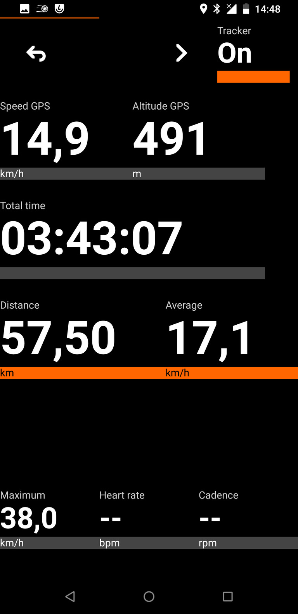
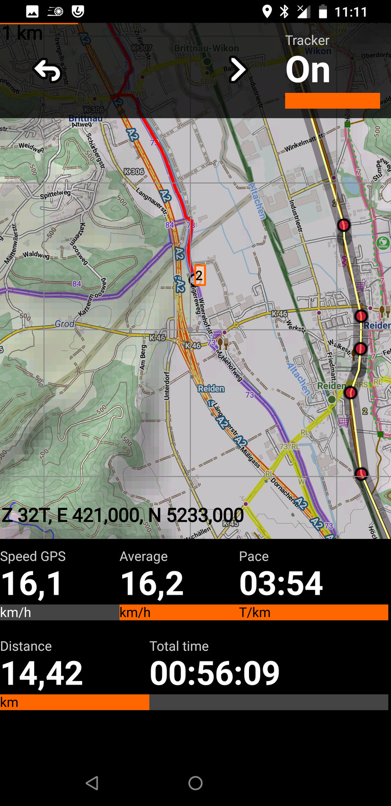

# AAT Another Activity Tracker
AAT is a GPS-tracking application for tracking sportive activities, with emphasis on cycling.

## Features
* Display live tracking on different cockpit and map views.
* Store tracks in [standard GPX format](https://www.topografix.com/gpx.asp) for sharing with other applications.
* Display [offline](https://github.com/mapsforge/mapsforge/blob/master/docs/Mapsforge-Maps.md) as well as [tile based](https://www.openstreetmap.org) maps.
* Tile based overlays for displaying cycle and hiking routes [(Waymarked Trails)](http://www.waymarkedtrails.org/).
* Integration of [Overpass](http://wiki.openstreetmap.org/wiki/Overpass_API) and [Nominatim](http://nominatim.openstreetmap.org).
* Simple GPX editor for quick route planning.
* GPS independent altitude information and hill shading.

## Availability
Get source code at [GitHub](https://github.com/bailuk/AAT)  
Install from [F-Droid](https://f-droid.org/repository/browse/?fdid=ch.bailu.aat)

## Copyright
(c) 2011-2022 Lukas Bai bailu@bailu.ch  
license: [GNU GPLv3 or later](http://www.gnu.org/licenses/gpl.html)  

### Contributors
Logo designed by Ibrahim Tenekeci  
All contributors: [https://github.com/bailuk/AAT/graphs/contributors](https://github.com/bailuk/AAT/graphs/contributors)

### Map tiles
(c) [OpenStreetMap, CC-BY-SA 2.0](http://wiki.openstreetmap.org/wiki/Legal_FAQ)  
(c) [Waymarked Trails, CC BY-SA 3.0 DE](http://waymarkedtrails.org/en/help/legal)  
OpenTopoMap: (c) [OpenStreetMap](https://www.openstreetmap.org/copyright)-Mitwirkende, SRTM | Kartendarstellung: (c) [OpenTopoMap](https://opentopomap.org/#map=5/49.000/10.000) ([CC-BY-SA](https://creativecommons.org/licenses/by-sa/3.0/))  
OpenCycleMap: (c) [Thunderforest](https://www.thunderforest.com/), Data (c) [OpenStreetMap](https://www.openstreetmap.org/copyright) contributors [CC-BY-SA 2.0](https://creativecommons.org/licenses/by-sa/2.0/)

### Mapsforge
(c) [Mapsforge project](https://github.com/mapsforge/mapsforge)  
license: [GNU Lesser GPL v3](http://www.gnu.org/licenses/lgpl.html)

### Digital elevation model (DEM)
DEM3 tiles are taken from [viewfinderpanoramas.org](http://viewfinderpanoramas.org) and are [repackaged](https://bailu.ch/dem3).
Most tiles are originally from the [2000 Shuttle Radar Topography Mission](https://wiki.openstreetmap.org/wiki/SRTM).
See [viewfinderpanoramas.org/dem3.html](http://viewfinderpanoramas.org/dem3.html) for details.

## Documentation
[README.enduser.md](README.enduser.md) provides information on how to use this app and on how to contribute to it.

## Donate  
You can support this project with a [donation](https://bailu.ch/aat/donate.html).

## Screenshots

