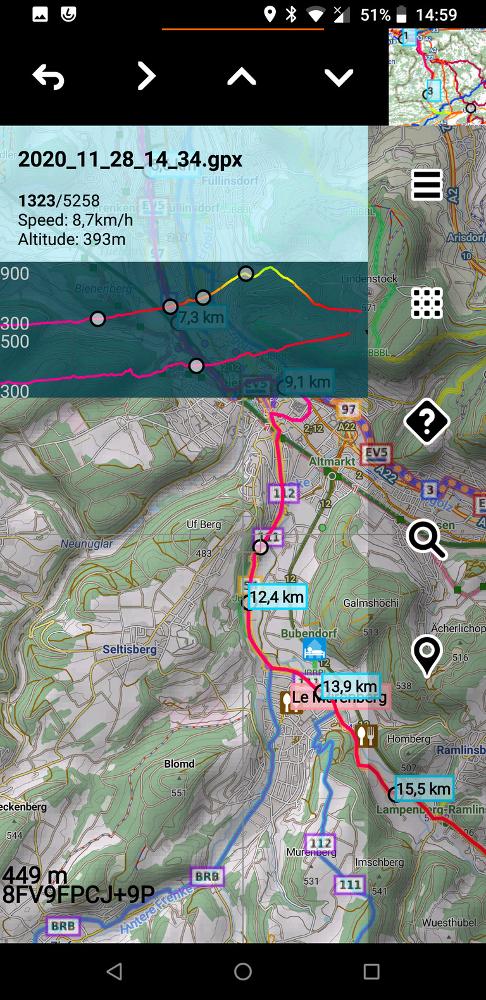

# AAT Activity Tracker

AAT is a GPS-tracking application for tracking sportive activities, with emphasis on cycling.

There is an Android and GTK variant. (The GTK variant is alpha software)

## Features

* Display live tracking on different cockpit and map views.
* Store tracks in [standard GPX format](https://www.topografix.com/gpx.asp) for sharing with other applications.
* Display [offline](https://github.com/mapsforge/mapsforge/blob/master/docs/Mapsforge-Maps.md) as well as [tile based](https://www.openstreetmap.org) maps.
* Tile based overlays for displaying cycle and hiking routes [(Waymarked Trails)](http://www.waymarkedtrails.org/).
* Integration of [Overpass](http://wiki.openstreetmap.org/wiki/Overpass_API) and [Nominatim](http://nominatim.openstreetmap.org).
* Display Offline POIs from Mapsforge compatible Databases, available from [OpenAndroMaps](https://www.openandromaps.org/en) and other places.  
* Simple GPX editor for quick route planning.
* GPS independent altitude information and hill shading from [DEM3 tiles](https://bailu.ch/dem3/)
* Support for Bluetooth and internal sensors

## Screenshot

[More screenshots](doc/screenshots.md)

## Installation and Distribution

- AAT for Android is available on [F-Droid](https://f-droid.org/repository/browse/?fdid=ch.bailu.aat)
- GTK builds are available on this projects [release page](https://github.com/bailuk/AAT/releases)

## Configuration and use

- Information about configuring and using this app: [doc/manual.md](doc/manual.md)
- GTK variant specific information: [doc/aat-gtk.md](doc/aat-gtk.md) 

## Compile

- Build instructions: [doc/compile.md](doc/compile.md) 

## License

[GNU GPLv3 or later](http://www.gnu.org/licenses/gpl.html)

### Map tiles

© [OpenStreetMap, CC-BY-SA 2.0](http://wiki.openstreetmap.org/wiki/Legal_FAQ)  
© [Waymarked Trails, CC BY-SA 3.0 DE](http://waymarkedtrails.org/en/help/legal)  
OpenTopoMap: © [OpenStreetMap](https://www.openstreetmap.org/copyright)-Mitwirkende, SRTM | Kartendarstellung: © [OpenTopoMap](https://opentopomap.org/#map=5/49.000/10.000) ([CC-BY-SA](https://creativecommons.org/licenses/by-sa/3.0/))  
OpenCycleMap: © [Thunderforest](https://www.thunderforest.com/), Data © [OpenStreetMap](https://www.openstreetmap.org/copyright) contributors [CC-BY-SA 2.0](https://creativecommons.org/licenses/by-sa/2.0/)

### Mapsforge

© [Mapsforge project](https://github.com/mapsforge/mapsforge)  
license: [GNU Lesser GPL v3](http://www.gnu.org/licenses/lgpl.html)

### Digital elevation model (DEM)

DEM3 tiles are taken from [viewfinderpanoramas.org](http://viewfinderpanoramas.org) and are [repackaged](https://bailu.ch/dem3).
Most tiles are originally from the [2000 Shuttle Radar Topography Mission](https://wiki.openstreetmap.org/wiki/SRTM).
See [viewfinderpanoramas.org/dem3.html](http://viewfinderpanoramas.org/dem3.html) for details.
