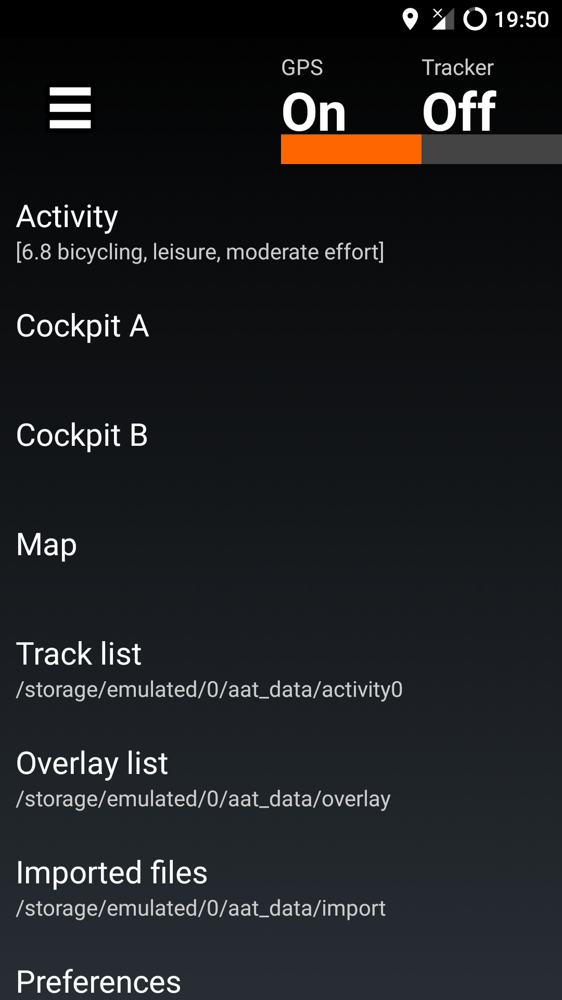
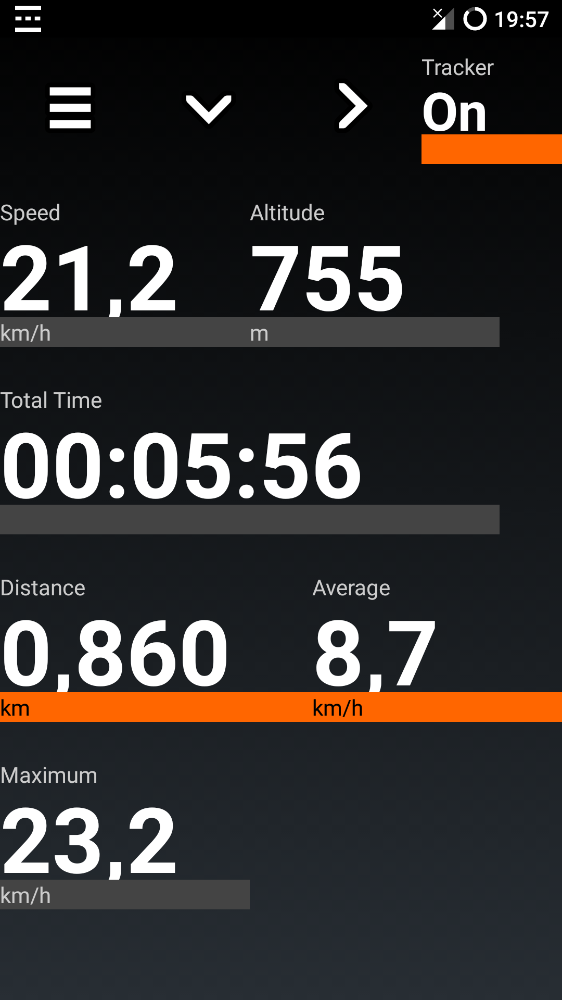
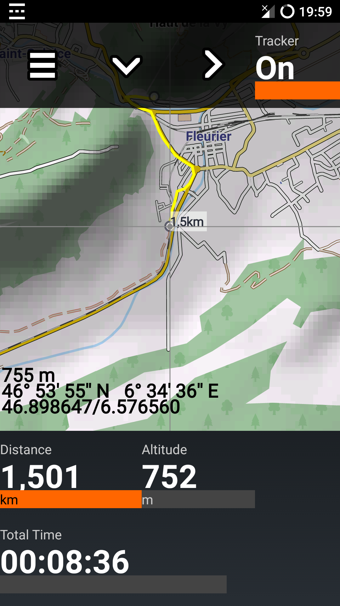
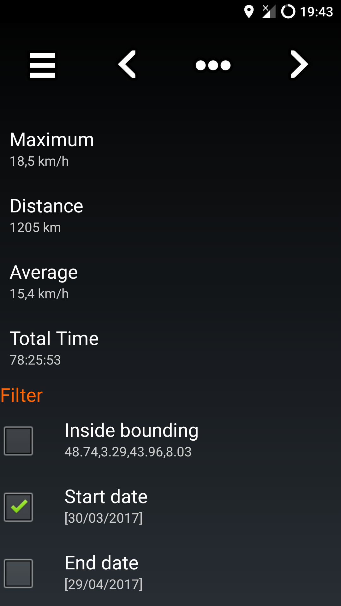
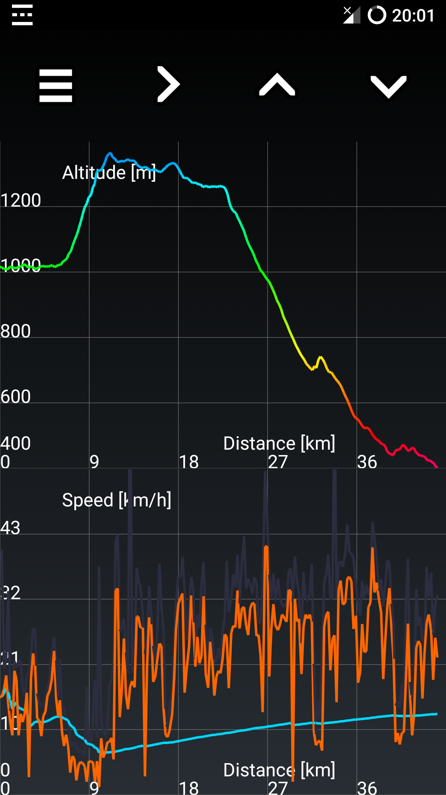
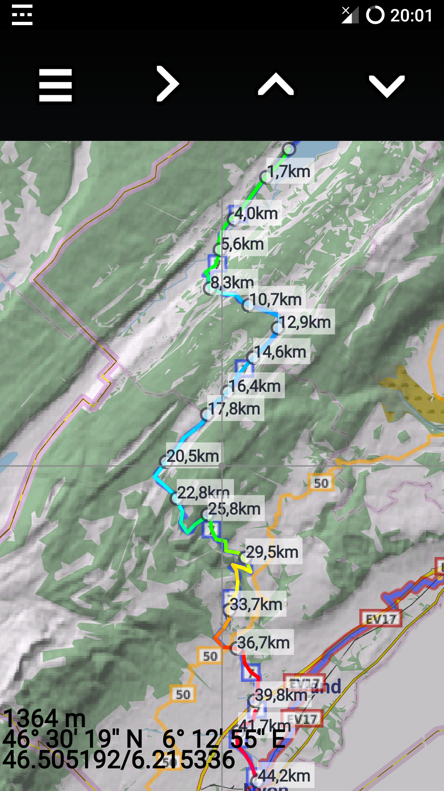
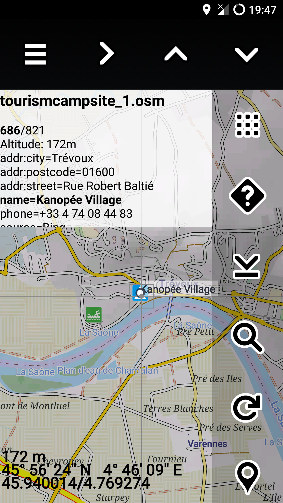
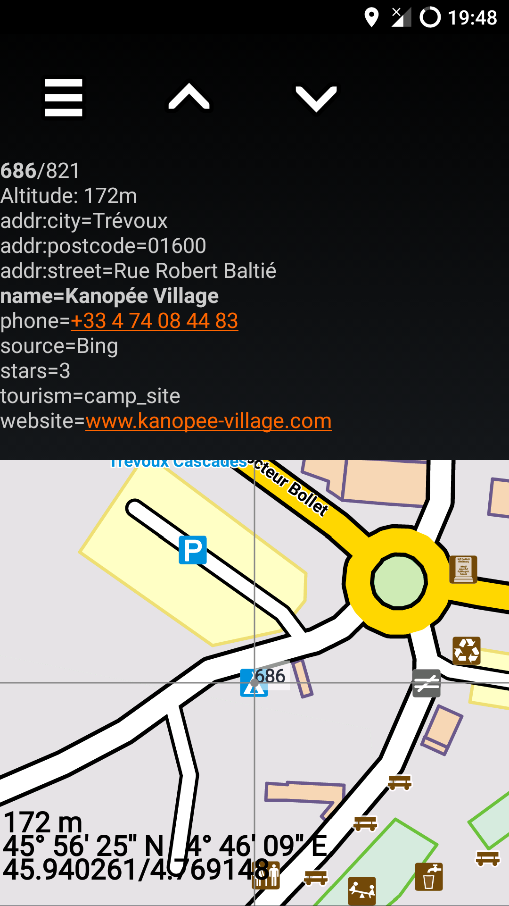

# AAT Another Activity Tracker
AAT is a GPS-tracking application for tracking sportive activities, with emphasis on cycling.
It features:
* Display live tracking on different cockpit and map views.
* Store tracks in [standard GPX format](https://www.topografix.com/gpx.asp) for sharing with other applications.
* Display [offline](http://download.mapsforge.org) as well as [tile based](https://www.openstreetmap.org) maps.
* Tile based overlays for displaying cycle and hiking routes [(Waymarked Trails)](http://www.waymarkedtrails.org/).
* Integration of [Overpass](http://wiki.openstreetmap.org/wiki/Overpass_API) and [Nominatim](http://nominatim.openstreetmap.org).
* Simple GPX editor for quick route planing.
* GPS independent altitude information and hill shading.

# Copyright
## Map tiles
(c) [OpenStreetMap, CC-BY-SA 2.0](http://wiki.openstreetmap.org/wiki/Legal_FAQ)  
(c) [Waymarked Trails, CC BY-SA 3.0 DE](http://waymarkedtrails.org/en/help/legal)

## Mapsforge
(c) [Mapsforge project](https://github.com/mapsforge/mapsforge)  
license: [GNU Lesser GPL v3](http://www.gnu.org/licenses/lgpl.html)

## AAT
(c) 2011-2018 Lukas Bai bailu@bailu.ch  
license: [GNU GPLv3 or later](http://www.gnu.org/licenses/gpl.html)  
Logo designed by Ibrahim Tenekeci  

# Availability
Source: [GitHub](https://github.com/bailuk/AAT)  
Binary: [F-Droid](https://f-droid.org/repository/browse/?fdid=ch.bailu.aat)

# Documentation
[README](README.enduser.md)

# Donate  
You can support this project with a [donation](https://bailu.ch/aat/donate.html)

# Screenshots

