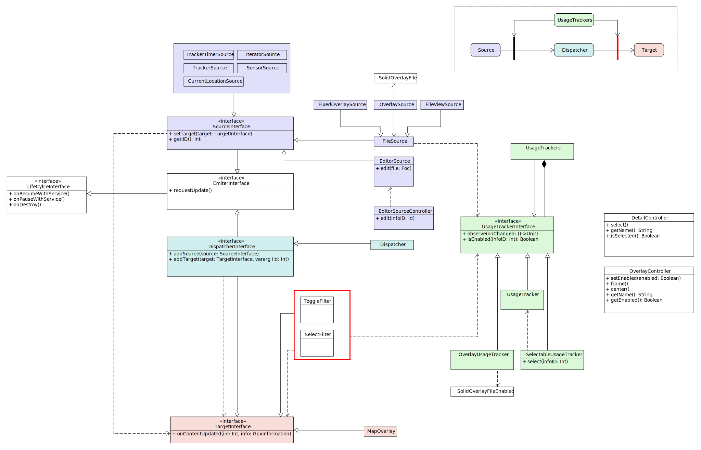

# Overview

This project is written in Java and Kotlin and uses the [Gradle Build Tool](https://gradle.org/) for building.
Use the gradle wrapper to execute gradle:
`./gradlew task` Gives you a list of all build tasks.

# Download

git clone https://github.com/bailuk/AAT.git

# Build and Install

## Android variant

### Prerequisite

- Android SDK with or without [Android Studio](https://developer.android.com/studio/)
- [Android Debug Bridge (adb)](https://developer.android.com/studio/command-line/adb)

### Build

```bash
export ANDROID_SDK_ROOT=~/Android/Sdk/ 
./gradlew aat-android:build
find app/build/outputs -name "*.apk"
```

### Install

```bash
find app/build/outputs -name "*.apk"
adb install app/build/outputs/apk/debug/app-debug.apk
```

## GTK variant

### Prerequisite

- glib-compile-resource (libglib2.0-bin)
- GTK4 Runtime libraries

### Build
```bash
# build
./gradlew aat-gtk:build

# build & run
./gradlew aat-gtk:run
```

### Install

```bash
# install
cd aat-gtk/util
./install.sh  # Options: `--build` and `--run`

# Remote
util/install.sh user@host
```

# Architecture

## Modules

This project is divided into the following modules:

### aat-lib/

Platform independent library classes. Contains code that is shared by all platform versions.

###  aat-android/

Android version.

### aat-gtk/

GTK Version. Uses [java-gtk](https://github.com/bailuk/java-gtk).

## Diagrams

Event-driven architecture style for handling GPX, Location, Tracker and Sensor updates.   


